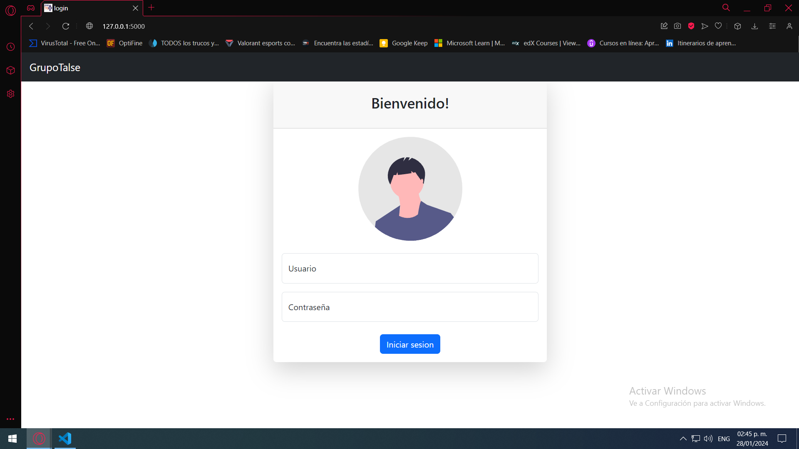
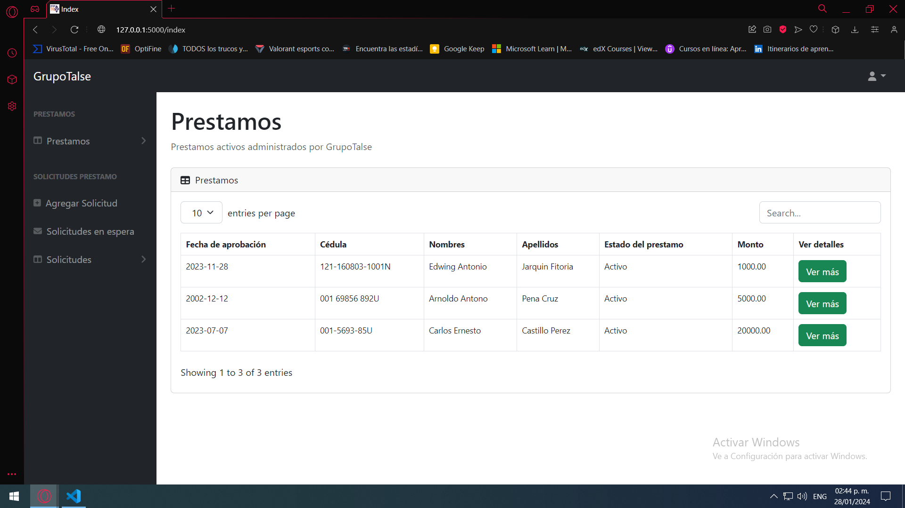
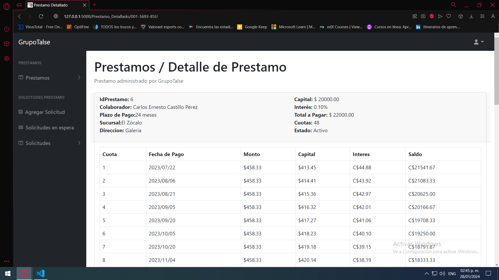
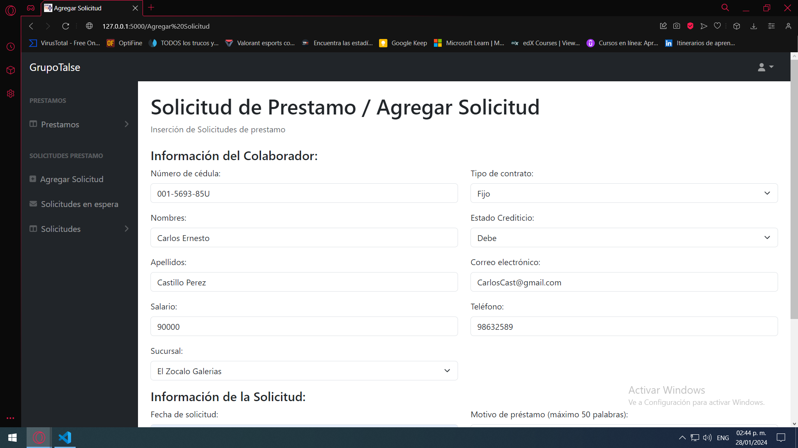
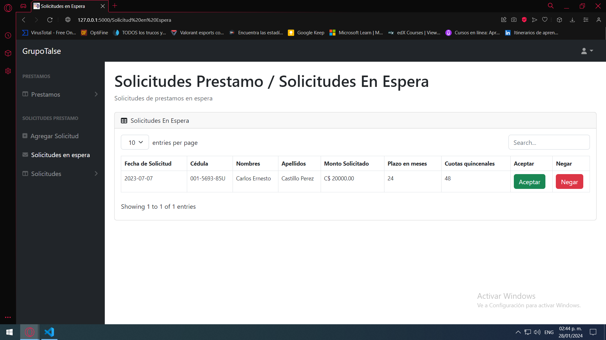
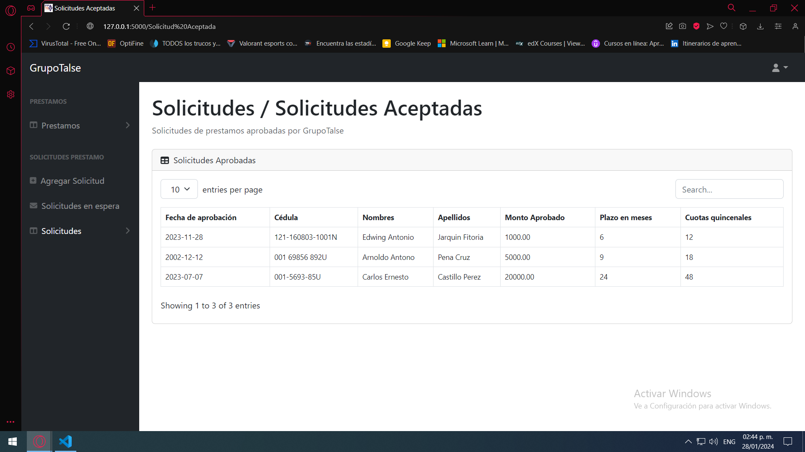

# Proyecto-Base-De-Datos
# Grupo Talse - Sistema de Gestión Financiera
## Introducción
Grupo Talse, un referente en la industria gastronómica nicaragüense desde su fundación en 1997, ha consolidado su posición como líder en la administración de diversas cadenas de restaurantes y cafeterías. Con un compromiso continuo hacia la excelencia, hemos desarrollado un prototipo de sistema web como proyecto final para la clase "Base de Datos".
Desde sus inicios, Grupo Talse ha destacado por ofrecer una experiencia culinaria única y servicios de alta calidad. Como respuesta a los desafíos operativos y administrativos, surge este innovador sistema de gestión financiera, diseñado para potenciar la eficiencia en la administración de préstamos, una faceta esencial en el desarrollo continuo de sus operaciones.

# Características Principales
Autenticación: El sistema cuenta con un sistema de inicio de sesión seguro para garantizar la privacidad de la información.

Secciones Principales:
Préstamos: Visualización de préstamos activos y cancelados con información detallada.

Préstamos Detallados:  Visualización de informacion en general del prestamo como fechas de pago, monto, intereses, etc. 

Agregar Solicitud: Formulario para solicitar préstamos.

Solicitudes en Espera: Sección para que el administrador acepte o rechace solicitudes en proceso.

Historial de Solicitudes: Información de solicitudes aceptadas y rechazadas.

Diagrama SQLServer:

## Tecnologías Utilizadas
Lenguajes:
-  Js
-  Python

Framework:
-  Flask

Base de Datos:
-  SQLServer

Herramientas: 
-  Git

